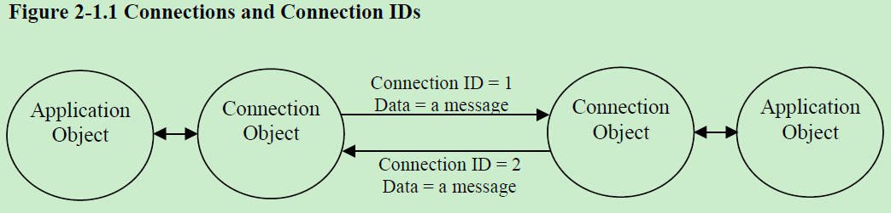
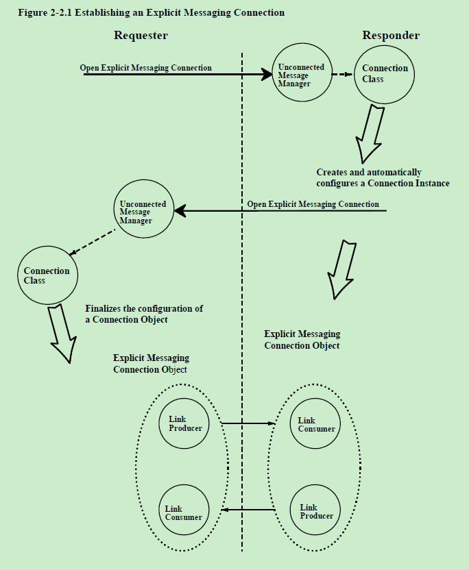
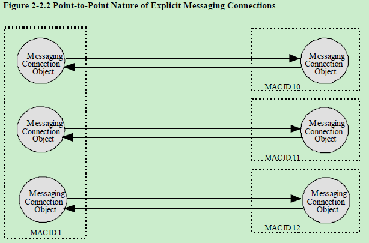
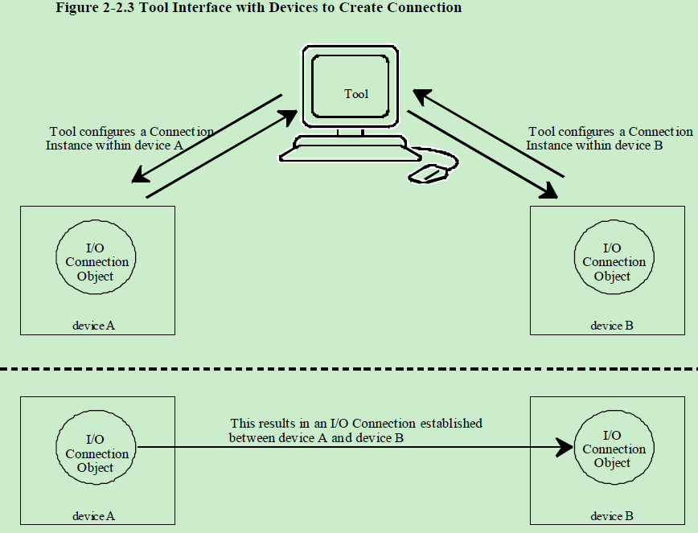
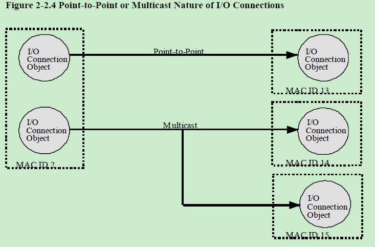
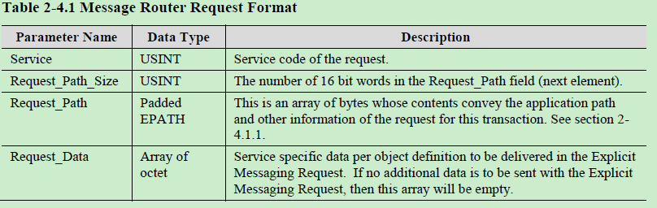
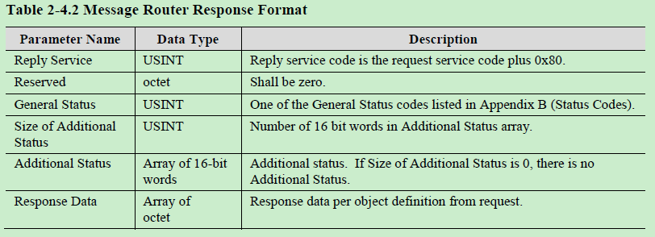

# Chapter 2 消息协议

## 目录
[TOC]

## 2-1 介绍

CIP分层在基于连接的网络的顶部。一个CIP连接提供了多个应用之间的路径。
当建立连接时，与该连接相关联的传输被分配一个连接ID（CID）。
如果连接涉及双向数据交换，则分配两个连接ID。
参见Figure 2-1.1

## 2-2 连接建立概述

本节介绍动态建立显式消息连接和I/O连接的概述。

### 2-2.1 显式消息和UCMM

未连接消息管理器（UCMM）负责处理未连接的显式请求和响应，包括显式消息和I/O连接的确定。
底层的网络决定如何访问UCMM，同时可能会限制允许在UCMM上传递的消息。

当使用UCMM建立显式消息连接时，目标应用程序对象是消息路由器对象Message Router object（Class Code 2）。

显式消息连接是无条件的点对点连接（point-to-point）。
点对点连接只存在于两个设备之间。
请求打开连接的设备（客户端）是连接的一个端点，而接收并相应该请求的模块（服务器）是另一个端点。
见Figure 2-2.2

### 2-2.2 I/O连接
CIP的网络定义允许建立各种I/O连接。
本规范对谁来执行连接配置相关的问题不做任何规定。
例如，一个工具可以与两个独立的设备连接，并在它们之间创建一个I/O连接。
见Figure 2-2.3.

该工具使用各种显式消息服务来创建和配置端点内的I/O连接对象。

I/O连接可以是点对点或组播。组播允许多个节点在一次传输中都能收到数据。
见Figure 2-2.4.

## 2-3 客户端和服务器连接端点

在讨论与连接端点相关联的行为时，本文档中将使用术语“客户端”和“服务器”。
客户端端点和服务器端点可以和显式消息连接关联，也可以和I/O连接关联。
客户端是发起传输的模块，服务器是对该传输做出反应的模块。
服务器的反应可能会导致它向客户端返回消息。

## 2-4 消息路由器请求/响应格式

CIP定义了一种标准数据格式用于向消息路由器对象(see Chapter 5A-3)传递数据。
该数据格式用在CIP中的各个地方，包括Connection Manager对象的Unconnected Send服务和在大多数CIP网络中UCMM使用的数据结构。

### 2-4.1 消息路由器请求

表格2-4.1 消息路由器请求格式

|参数名称           |数据类型  |描述                                    | 
|------------------|---------|----------------------------------------|
|Service           |USINT    |请求的服务代码                           |
|Request_Path_Size |USINT    |Request_Path字段中以双字节(16位)计算的字数（下一个元素）|
|Request_Path      |Padded EPATH |字节数值，表示在这次传输请求中的应用路径和其它信息|
|Request_Data      |Array of octet|特定服务的数据，由每个在显示消息中传输的对象定义的。如果没有附加的数据需要传输，则这个数组为空|

#### 2-4.1.1 Request_Path

请求路径的格式如下：

[Electronic Key segment]
Application Path

其中Electronic Key字段是有条件的。
如果通过连接发送请求，则不允许使用Electronic Key，否则为可选项。
如果Electronic Key存在，目标需要评估这个key。
参见section C-1.4.2 Electronic Key的定义，
参见section C-1.5 Application Path的格式定义。

请求路径的例子：

1. 34 04 42 42 0C 00 01 00 81 01  
Electronic Key字段指示目标设备必须兼容Vendor 0x4242, Device Type 0x000C, Product Code 0x0001, Major Revision 0x01, Minor Revision 0x01的设备
 
2. 20 04 24 01 30 03
应用路径指明了Assembly对象（0x04）的实例1的属性3

### 2-4.2 消息路由器响应

表格2-4.2 消息路由器响应格式

|参数名称           |数据类型  |描述                                    | 
|------------------|---------|----------------------------------------|
|Reply Service     |USINT    |响应服务代码是请求服务代码加0x80|
|Reserved          |octet    |应为0|
|General Status    |USINT    |附录B(状态码)中列出的一般状态代码之一|
|Size of Additional Status|USINT|附加状态数组中的字数(以双字节计算)|
|Additional Status |Array of 16-bit words|附加状态，如果上一字段为0，则没有附加状态|
|Response Data     |Array of octet |由每个对象定义的请求响应的数据|

