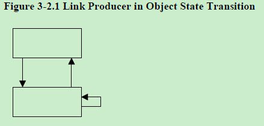
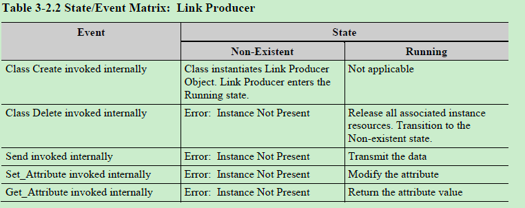
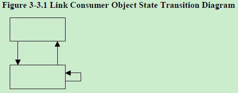
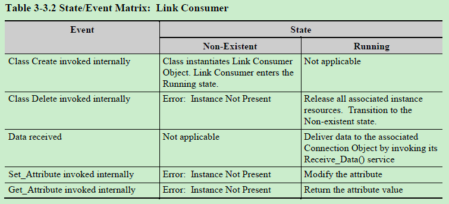
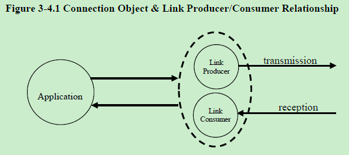
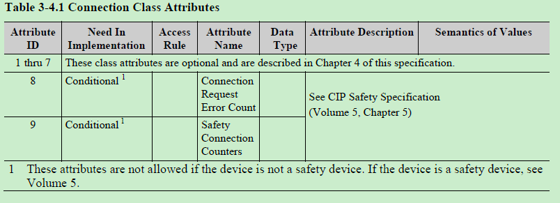

# Chapter 3 通讯对象类（Communication Object Classes）

## 目录
[TOC]

## 3-1 介绍
CIP的通讯对象管理和提供运行时的消息交换。在本章节详细介绍通讯对象类的服务（Services），属性（Attributes）和行为（Behaviors）。对象定义部分涉及属性的数据类型。可以查看附录C（Appendix C）获得CIP数据类型和数据管理的详细信息。

重要：以下各节的目的不在于指定任何特定的内部实现。

通讯对象类通过以下描述定义：
* 对象类的属性
* 对象类的服务
* 对象实例的属性
* 对象实例的服务
* 对象实例的行为

每个CIP连接由一个连接对象（Class code 0x05）表示。这个通讯对象资源的创建有两种方法。不同的子网类型决定使用哪种方法：
* 使用Connection对象的Create服务（Service code 0x08）
* 使用Connection Manager对象的Forward_Open服务

子网类型可能定义其它创建通讯对象资源的方法。例如DeviceNet的Allocate_Master/Slave_Connection_Set服务。有关子网类型特定方法的详细信息，请参阅相应的规范卷。

### 3-1.1 通过Connection对象创建连接

当子网定义通过Connection对象创建连接时，CIP设备将支持这个对象的Create服务。Create服务使用对象定义的默认值创建Connection实例。然后通过对每个Connection实例属性的访问来完成配置。最后需要独立的服务请求（Apply_Attributes,Service code 0x0D）才能将连接状态转换为确定状态（Established state）。

### 3-1.2 通过Connection Manager对象创建连接

当子网定义通过Connection Manager对象创建连接时，CIP设备将支持这个对象的Forward_Open服务。当服务成功完成，Connection Manager会创建一个Connection实例。这个实例使用Forward_Open服务中的默认值来配置，同时连接状态转换为确定状态（Established state）。这个单一的CIP服务请求在内部建模成一个Connection对象的服务请求（使用Create服务）和若干个内部服务请求（使用Set_Attribute_Single和Apply_Attributes服务）。支持通过Connection Manager对象创建连接的设备可能会也可能不会为Connection实例提供外部可见性。

## 3-2 Link Producer对象类定义

Link Producer对象是负责底层数据传输的组件。

重要：不存在通过显式消息连接访问的外部可见接口。在接下来的章节中描述的所有服务和属性都是内部行为。这些服务和属性只能通过Connection对象的属性和服务来访问。

### 3-2.1 Link Producer对象类属性

无属性

### 3-2.2 Link Producer对象类服务

以下是Link Producer对象支持的服务：
* Create——内部使用，实例化一个Link Producer对象
* Delete——内部使用，删除一个Link Producer对象

### 3-2.3 Link Producer对象实例属性

以下列表描述了Link Producer实例属性。

#### 3-2.3.1 state, USINT data type 
state包含Link Producer实例当前的状态。可能的状态内容如下：

Table 3-2.1 Link Producer States
| 状态名称 | 描述|
|------------|-------------|
|Non-existent|Link Producer尚未实例化|
|Running |Link Producer已被实例化，并且正在等待被调用Send服务进行数据传输。|

#### 3-2.3.2 connection_id

当Link Producer被触发发送时，connection_id的值会包含在消息报文中。这个值在报文中的位置和格式由子网类型定义。使用此Link Producer的Connection对象用produced_connection_id属性值来初始化connection_id。参见3-4.4，produced_connection_id属性的定义

### 3-2.4 Link Producer对象实例服务

Link Producer对象实例支持的服务如下所示：
* Send, 内部使用，告诉Link Producer将数据传输到子网。
* Get_Attribute，内部使用，读取Link Producer对象实例的属性。
* Set_Attribute，内部使用，修改Link Producer对象实例的属性。

### 3-2.5 Link Producer对象实例行为

Figure 3-2.1 和 Table 3-2.2 说明Link Producer对象实例的行为。

## 3-3 Link Consumer对象类定义

Link Consumer对象是负责底层数据传输的组件。

重要：不存在通过显式消息连接访问的外部可见接口。在接下来的章节中描述的所有服务和属性都是内部行为。这些服务和属性只能通过Connection对象的属性和服务来访问。

### 3-3.1 Link Consumer对象类属性

无属性

### 3-3.2 Link Consumer对象类服务

以下是Link Consumer对象支持的服务：
* Create——内部使用，实例化一个Link Consumer对象
* Delete——内部使用，删除一个Link Consumer对象

### 3-3.3 Link Consumer对象实例属性

以下列表描述了Link Consumer实例属性。

#### 3-3.3.1 state, USINT data type 
state包含Link Consumer实例当前的状态。可能的状态内容如下：

Table 3-3.1 Link Consumer States
| 状态名称 | 描述|
|------------|-------------|
|Non-existent|Link Consumer尚未实例化|
|Running |Link Consumer已被实例化，并且正在等待接收消息。|

#### 3-3.3.2 connection_id

这个属性值保存消费者接收到的消息报文中的Connection ID值。这个值在消息报文中的位置和格式由子网类型定义。使用此Link Consumer的Connection对象用consumed_connection_id属性值来初始化connection_id。参见3-4.4，consumed_connection_id属性的定义。

### 3-3.4 Link Consumer对象实例服务

Link Consumer对象实例支持的服务如下所示：
* Get_Attribute，内部使用，读取Link Consumer对象实例的属性。
* Set_Attribute，内部使用，修改Link Consumer对象实例的属性。

### 3-3.5 Link Consumer对象实例行为

Figure 3-3.1 和 Table 3-3.2 说明Link Consumer对象实例的行为。

## 3-4 Connection对象类定义

Class Code: 05 hex

Connection对象类分配和管理与I/O连接和显式消息连接相关的内部资源。由Connection类生成的特定实例称为Connection Instance或Connection Object。

除非另有说明，以下内容中注明的所有服务/属性均可使用显式消息传递。

特定模块内的Connection对象实际上表示连接中的一个端点。连接中的一个端点可以被配置为“活跃”（例如发送）而不需要其它端点存在。Connection对象用于特定应用到应用之间传输特征的建模。

一个特定的Connection对象实例管理与端点相关的特定通讯。一个Connection对象使用Link Producer或Link consumer提供的服务完成底层数据的传输和接收功能。

### 3-4.1 Connection对象类属性

Connection对象类属性定义在下面的Table 3-4.1

## 3-5 使用0类或1类传输的应用程序连接类型
## 3-6 端口对象类定义